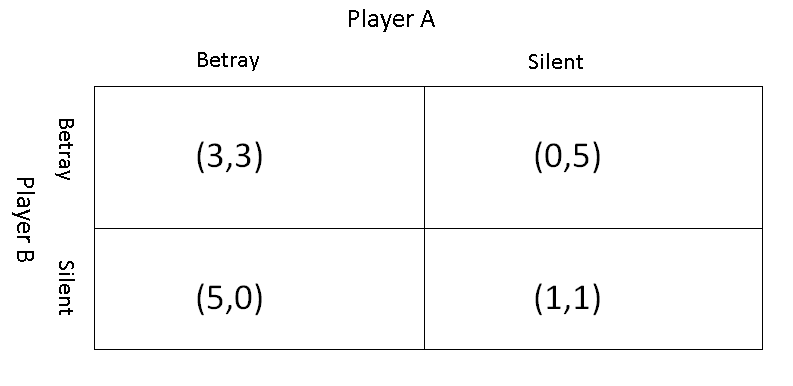

#### IDH1 Mutation and 1p19q co-deletion prediction from MRI for brain cancer.
### by Sourav Singh, Rasika Mahadeshwar, Manali Bhavsar and Sumeet Rathod 

+++

@snap[midpoint]
under guidance from Prof. (Ms.) Disha S. Wankhede
in collaboration with Tata Memorial Centre, Mumbai

---

#### Introduction

+++


+++


+++


---
# Motivation

- Patients with brain cancer aren't so lucky.
- Mean and median survival for a patient with brain cancer is 15 and 16 months upon getting treatment.
- India is third largest in number of incident cases of brain cancer. [Reference](https://www.thelancet.com/journals/laneur/article/PIIS1474-4422(18)30468-X/fulltext?rss=yes)
- Timely diagnosis and treatment is important to combat brain cancer.
- Machine learning can help in quick diagnosis of brain cancer and has been used before.

---

- Knowing genetic mutations and co-deletions of chromosomes can help guide the treatment.
- Checking genetic mutations and co-deletions require complicated tests(immunoassays, sequencing, FISH).
- Cost money and time.

---

#### Existing Systems and their limitations

- Current systems use 2D CNNs or ML methods to classify genetic mutation type for IDH1- wildtype vs mutant.
- 1p19q co-deletions- Normal or deleted.
- Current systems do not take into account the volumetric space of brain tumor.
- ML methods are limited by the features obtained from MRI.
- Current systems have only been trained on brain images which are taken from patient trials at America/Europe.

--- 

#### Proposed system

- System will make use of brain MRI scans of various modalities as input.
- The input will be checked for file format type, parity and stuff.
- 3D ConvNet will obtain volumetric features and use it to classify tumor type and co-deletion status.

---

#### Purpose

- Help diagnosticians in knowing mutation and co-deletion status.
- Drive treatment protocol in a useful manner.
- Alleviates need for complicated lab tests.

---
### Payoff Matrix(Outcome of game playing between two players A and B)



---
#### More on Prisoner's Dilemma


Taken from [https://xkcd.com/1016/](https://xkcd.com/1016/)
---
#### Iterated Prisoner's Dilemma

1. Started out by Robert Axelrod as a student in 1962.
2. [Axelrod1980](http://citeseerx.ist.psu.edu/viewdoc/download?doi=10.1.1.665.7955&rep=rep1&type=pdf): 15 strategies
3. [Axelrod1980b](http://journals.sagepub.com/doi/abs/10.1177/002200278002400301): 65 strategies

---

### IPD in Python

---

### Basic Strategy for IPD

```python
class TitForTat(Player):
    """A player starts by cooperating and then mimics previous move by opponent."""

    name = 'Tit For Tat'
    classifier = {
        'memory_depth': 1,  # Four-Vector = (1.,0.,1.,0.)
        'stochastic': False,
        'inspects_source': False,
        'manipulates_source': False,
        'manipulates_state': False
    }

    @staticmethod
    def strategy(opponent):
        return 'D' if opponent.history[-1:] == ['D'] else 'C'
```
---

#### Demo time!

---

---

The Axelrod library

Greet us at [Gitter!!](https://gitter.im/Axelrod-Python/Axelrod)

Docs- [axelrod.readthedocs.io](axelrod.readthedocs.io)

---

Thanks to Axelrod-Python community, especially to Dr. Vincent Knight for the help!!

---

Thank you!

---
